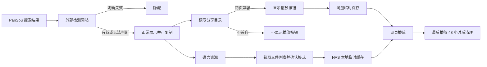

# 飞海网盘

飞海网盘是一套面向飞牛 fnOS 的私人网盘影视搜索、同盘保存与网页播放平台。它直接连接百度网盘、夸克网盘、115 网盘和中国移动云盘，不依赖 OpenList，也不读取飞牛的远程挂载目录。

当前版本：`1.0.27`

## 核心能力

- 首页展示实时影视排行、轮播大图、海报、简介、年份、地区和类型筛选。
- 新上映作品显示红色“新片”，其他作品保留 TMDB 评分；卡片右上角始终显示评分。
- 资源搜索对接用户自己的 PanSou。
- 网盘链接有效性完全采用用户自己的检测网站结果：只隐藏明确失效的链接。
- 所有未失效链接均可复制；只有确认适合浏览器播放的文件才显示“播放”。
- 播放时先同盘保存到“影视临时播放”，最后一次播放 48 小时后自动删除。
- PanSou 磁力资源始终可以复制；点击“检查播放”后，NAS 获取文件列表，只为确认适合网页播放的视频提供播放入口。
- 磁力播放使用 NAS 本地临时缓存，默认单个视频不超过 30 GB，可通过 `MAGNET_MAX_GB` 调整；完成下载与编码确认后在网页内播放，48 小时后清理。
- 管理员可把分享资源同盘永久保存，并逐级选择目标文件夹；不进行跨盘传输。
- 115 支持页面直接显示二维码，并绑定为支付宝小程序设备类型，减少与常用网页/电脑端会话冲突；百度、夸克和移动云盘使用各自可用的授权凭证。
- 管理员专属：网盘账号、同盘保存、追更、任务、风控状态和设置。
- 访客可用：首页、影视排行、资源搜索、简介、复制链接和在线播放。

## 访问规则

| 功能 | 访客 | 管理员 |
|---|---:|---:|
| 首页排行与筛选 | ✓ | ✓ |
| 搜索网盘资源 | ✓ | ✓ |
| 复制分享链接 | ✓ | ✓ |
| 网页兼容资源播放 | ✓ | ✓ |
| 同盘永久保存 | — | ✓ |
| 追更与任务 | — | ✓ |
| 网盘授权与设置 | — | ✓ |

## 网页播放规则

优先识别 `MP4 + H.264 + AAC` 等浏览器可直接播放的文件。HEVC、Dolby Vision、DTS、TrueHD 等格式仍可复制或同盘保存，但不会误显示直接播放按钮。磁力链接不会交给浏览器直接打开，而由容器内置的下载组件获取所选视频；容器仍只对外映射 `12366`。



## 飞牛应用中心一键安装

详细步骤见 [飞牛 fnOS 可视化安装教程](docs/FNOS_INSTALL.md)。

1. 从 [GitHub Releases](https://github.com/micaibiji/feihai-netdisk/releases/latest) 下载 `feihai-drive_1.0.27_all.fpk`。
2. 打开飞牛 **应用中心 → 本地安装**，选择 FPK 文件。
3. 确认安装设置并完成安装。
4. 从桌面打开“飞海网盘”，或访问 `http://飞牛IP:12366/`。
5. 默认管理员账号和密码均为 `admin`，首次登录后建议修改密码。

项目只映射 `12366`，不会额外占用 OpenList 或其他管理端口。

开发者可运行 `python deploy-fnos/build_fpk.py` 重新生成 FPK。传统 Docker Compose 部署仍保留为兼容安装方式。

## 在飞牛里点击升级

仓库公开后，每个版本标签都会自动构建并发布 FPK、SHA256 校验文件和 `latest.json`。软件源文件固定为：

```text
https://raw.githubusercontent.com/micaibiji/feihai-netdisk/main/micaibiji.json
```

在飞牛安装一次支持自定义 GitHub 软件源的 **FN软仓**，添加上面的地址；以后飞海网盘发布更高版本时，会直接出现 **更新** 按钮。安装和升级仍由 fnOS 应用中心完成，飞海网盘容器不会取得主机管理员权限，也不会增加新端口。

如果以后通过飞牛官方审核并上架，升级按钮会直接出现在官方应用中心，无需再使用第三方软件源。

## 开发检查

```powershell
python -m pytest -q
node --check app/static/app.js
```

功能边界与验收标准见 [产品需求说明](docs/PRODUCT_REQUIREMENTS.md)。
