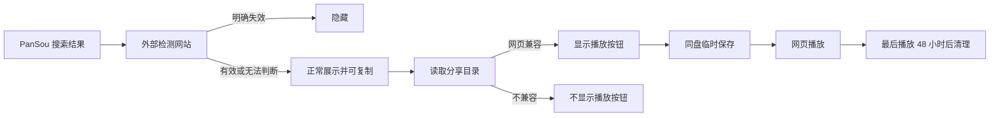

# 飞海网盘

飞海网盘是一套面向飞牛 fnOS 的私人网盘影视搜索、同盘保存与网页播放平台。它直接连接百度网盘、夸克网盘、115 网盘和中国移动云盘，不依赖 OpenList，也不读取飞牛的远程挂载目录。

当前版本：`1.0.2`

## 核心能力

- 首页展示实时影视排行、轮播大图、海报、简介、年份、地区和类型筛选。
- 新上映作品显示红色“新片”，其他作品保留 TMDB 评分；卡片右上角始终显示评分。
- 资源搜索对接用户自己的 PanSou。
- 网盘链接有效性完全采用用户自己的检测网站结果：只隐藏明确失效的链接。
- 所有未失效链接均可复制；只有确认适合浏览器播放的文件才显示“播放”。
- 播放时先同盘保存到“影视临时播放”，最后一次播放 48 小时后自动删除。
- 管理员可把分享资源同盘永久保存，并逐级选择目标文件夹；不进行跨盘传输。
- 115 支持页面直接显示二维码；百度、夸克和移动云盘使用各自可用的授权凭证。
- 管理员专属：网盘账号、同盘保存、追更、任务、风控状态和设置。
- 访客可用：首页、影视排行、资源搜索、简介、复制链接和在线播放。

## 访问规则

| 功能 | 访客 | 管理员 |
|---|---:|---:|
| 首页排行与筛选 | ✓ | ✓ |
| 搜索网盘资源 | ✓ | ✓ |
| 复制分享链接 | ✓ | ✓ |
| 网页兼容资源播放 | ✓ | ✓ |
| 同盘永久保存 | — | ✓ |
| 追更与任务 | — | ✓ |
| 网盘授权与设置 | — | ✓ |

## 网页播放规则

优先识别 `MP4 + H.264 + AAC` 等浏览器可直接播放的文件。HEVC、Dolby Vision、DTS、TrueHD 等格式仍可复制或同盘保存，但不会误显示直接播放按钮。



## 快速部署

详细步骤见 [飞牛 fnOS 可视化安装教程](docs/FNOS_INSTALL.md)。

1. 解压发布包。
2. 把 `.env.example` 重命名为 `.env`，修改管理员密码。
3. 在飞牛 Docker → Compose 中选择解压目录并使用已有 `docker-compose.yml`。
4. 启动后访问 `http://飞牛IP:12366/`。
5. 管理员登录后填写 PanSou、检测网站、TMDB 和网盘授权。

项目只映射 `12366`，不会额外占用 OpenList 或其他管理端口。

## 开发检查

```powershell
python -m pytest -q
node --check app/static/app.js
```

功能边界与验收标准见 [产品需求说明](docs/PRODUCT_REQUIREMENTS.md)。
